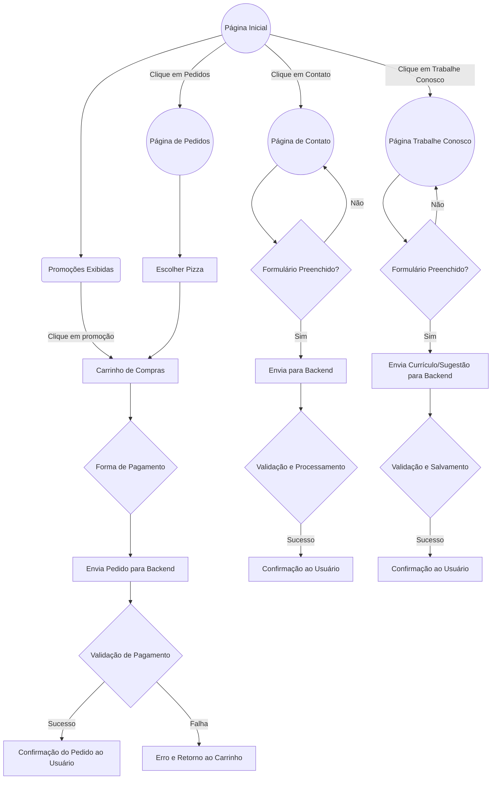

# Projeto Pizzaria - Fundamentos e Arquiteturas de Sistemas Web (UNIPE)

Este repositório contém o código-fonte e a documentação do projeto final da disciplina de Fundamentos e Arquiteturas de Sistemas Web, do curso de pós-graduação da UNIPE. O projeto consiste em uma aplicação web completa para uma pizzaria, permitindo que os usuários visualizem o cardápio, façam pedidos, conheçam a história da pizzaria, encontrem a localização, enviem currículos e muito mais.

## Visão Geral

A aplicação foi desenvolvida com o objetivo de aplicar os conhecimentos adquiridos ao longo da disciplina, explorando conceitos de arquitetura de software, tecnologias web modernas e melhores práticas de desenvolvimento.

## Funcionalidades Principais

* **Visualização do Cardápio:** Apresentação clara e organizada das pizzas disponíveis, com descrições, ingredientes e preços.
* **Realização de Pedidos:** Interface intuitiva para montagem do pedido, seleção de sabores, tamanhos, adicionais e opções de entrega/retirada.
* **Informações da Pizzaria:** Seção "Sobre Nós" com a história da pizzaria, valores e diferenciais.
* **Localização:** Mapa integrado para facilitar a localização da pizzaria, com informações de contato e horários de funcionamento.
* **Trabalhe Conosco:** Formulário para envio de currículos, permitindo que os interessados em fazer parte da equipe se candidatem às vagas.

## Diagrama do Projeto

Para visualizar o esboço inicial da arquitetura e o fluxo da aplicação, acesse o seguinte link:

[https://mm.tt/app/map/3682693930?t=isPg9SDs37](https://mm.tt/app/map/3682693930?t=isPg9SDs37)

## Fluxograma - Menus

## Tecnologias Utilizadas

* **Frontend:** 
    * Boostratp
    * HTML5
    * CSS3
    * JavaScript
* **Backend:** (Exemplo)
    * Node.js
    * Express
    * MongoDB
* **Outras Ferramentas:** (Exemplo)
    * Git
    * GitHub
## Autores

Rafael Carvalho e Thiago Vinicius
